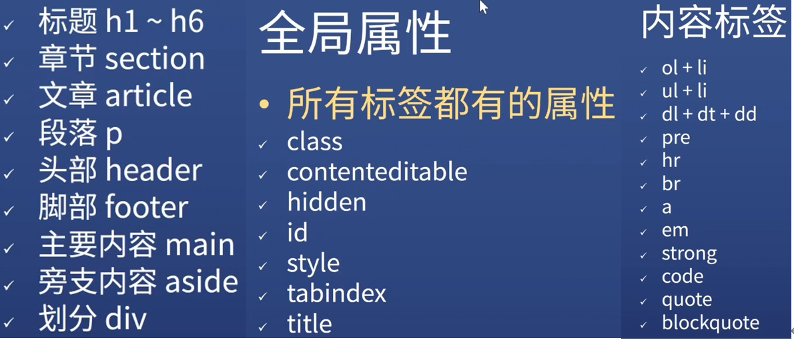

万维网是基于互联网实现的输入地址就能看到网页的一个网络。

www(万维网) = url + html +http

html（hypertext markup language）,谷歌搜索mdn html5 学习官方文档。

得到代码链接：
* 饥人谷jsbin（js.jirengu.com）：解决报错 → 登录-账号-偏好-linting；美化：ctrl +shift +L。
* codesandbox.io :可上传图片等其他文件，更为高级。


方方学习方法：把所有标签用嘴巴读一遍，了解其内容；全部忘掉，只记住div和span。开始学习css，找一个页面，仿写，发现有更合适的标签，就改用更合适的，继续写。

-放弃体系感，你会学得更快。

学一门语言必须学会什么？如何学？

语法（怎么写）、调试（知错）、查资料（抄代码）、标准制定者是谁。

CRM法：copy – run – modify（加入自己想法，重新运行）

# 语法
```
起手式：
<!DOCTYPE html>                     (声明文档类型)
<html lang="en">                    （可把 en 改为 zh-CN）
<head>
    <meta charset="UTF-8">          （文档的字符编码）
    <meta http-equiv="X-UA-Compatible" content="IE=edge">
    <meta name="viewport" content="width=device-width, initial-scale=1.0">
    <title>Document</title>
</head>
<body>
    
</body>
</html>

标签(tag)最好用小写,三种标签形式：
<tag attr=value>内容</tag>	（value可加可不加引号，多元素用可用引号形成整体）
<tag attr>内容</tag>	（ep. checked=‘false’时依然勾选）
<tag attr=value>		（自闭合；尾部无斜杠）

<!-- 注释 -->
```
### 调试：
看vscode/webstrom颜色；

npm工具：安装 yarn global add node-w3c-validator。
node-w3c-validator -i index.html(目标文件)；
node-w3c-validator - found errors 。

### 标签：


不到万不得已不要用id，因为id不报错；

html、css、js属性同时存在时，以js为最终效果。

tabindex=？ ：正数-按照大小顺序；0：最后访问；-1：不访问。

不换行用…代替多余内容：
*  white-space :nowrap; 
*  text-overflow:ellipsis; 
* overflow:hidden。
* title=“完整的内容~~~”。

由于html默认样式已经不符合要求，因此要引入CSS重设。
重设样式之抄大厂代码：大厂首页-右键检查-复制到自己的项目，重命名为reset.css。

ol/ul 中只能有 li 。code 标签中是等宽字体。


html中多个连续的空格或空行都会被合并成一个空格。用```<pre><pre/>```消除该影响。

### 清除默认样式：
```
<style>
        table { 
            width:500px;
            table-layout: auto;
            border-collapse: collapse;
            border-spacing: 0;
        }
        th,td {border: 1px solid skyblue;
        }
    </style>

响应式
<style>
        * {
            margin: 0;
            padding: 0;
            box-sizing: border-box;
        }
        img {
            max-width: 100%;
        }
    </style>
```